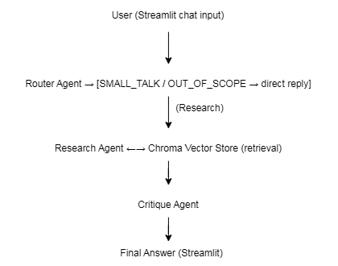
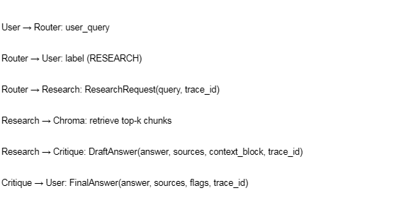

# AI Fitness & Lifestyle Research Assistant

An agentic AI system that helps users research evidence-informed fitness,
nutrition, sleep, and recovery questions by routing queries to specialised
agents, grounding answers in a curated research corpus (RAG), and
self-critiquing its own output before responding.

**Live demo:** [ ] paste your Streamlit Cloud URL here once deployed

## 1. Project Description

People often get fitness and nutrition advice from social media that
contradicts established research or guidelines. This assistant answers
questions by retrieving relevant passages from a curated set of research
summaries covering strength training, cardio, nutrition, sleep, recovery,
injury prevention, and related topics — then produces a grounded,
cited answer instead of guessing.

## 2. Architecture



The system has three agents:

1. **Router Agent** — classifies each query as RESEARCH, SMALL_TALK, or
   OUT_OF_SCOPE and decides where it goes next.
2. **Research Agent** — retrieves relevant chunks from a Chroma vector
   store and synthesises a grounded answer.
3. **Critique Agent** — reviews the draft answer against the retrieved
   context and flags any unsupported claims before returning the final
   answer.

### Agentic design patterns used

1. **Router pattern** — `agents/router_agent.py`. Classifies the incoming
   query and decides which downstream agent handles it.
2. **Tool-use / ReAct pattern** — `agents/research_agent.py`. The agent
   calls the retrieval tool (`rag/retriever.py`), and if the first
   retrieval comes back empty, reformulates and retrieves again before
   synthesising an answer.
3. **Reflection / self-critique pattern** — `agents/critique_agent.py`.
   Reviews the draft answer against the exact retrieved context and
   flags claims that aren't supported, appending a visible note if so.

## 3. Agent-to-Agent Communication



Agents exchange structured messages (defined in `agents/messages.py`)
rather than raw strings:

Each message carries a shared `trace_id` so a single request can be
traced end-to-end across all three agents.

## 4. Model Selection Strategy

| Sub-task | Model (provider) | Why chosen |
|---|---|---|
| Query routing / classification | Llama 3.1 8B Instant (Groq) | Sub-second latency, near-free per call, more than enough reasoning for a 3-way classification |
| Deep research synthesis (final answer) | Llama 3.3 70B Versatile (Groq) | Higher reasoning quality needed to synthesise multiple retrieved chunks into a coherent, accurately-cited answer; worth the extra latency vs the 8B model |
| Fact-checking / critique | Llama 3.1 8B Instant (Groq) | Comparing a draft against its own source context is narrower than generation, so the fast/cheap model is sufficient and keeps this step from adding much latency |

## 5. RAG Pipeline

- **Corpus**: 21 original documents covering strength training,
  progressive overload, cardio, macronutrients, protein intake,
  hydration, sleep, recovery, injury prevention, mobility, mental
  health, caffeine, alcohol, aging, supplements, and menstrual cycle
  considerations.
- **Chunking strategy**: recursive character splitting, 500 characters
  per chunk with 50-character overlap.
- **Embedding model**: `all-MiniLM-L6-v2` via sentence-transformers.
- **Vector store**: Chroma, persisted and committed to the repo so
  Streamlit Cloud deployment doesn't need to re-run ingestion.
- **Retrieval evaluation**: see [`rag/eval_queries.md`](rag/eval_queries.md).

## 6. Setup Instructions

```bash
git clone https://github.com/nimnawijerathne-png/fitness-research-assistant.git
cd fitness-research-assistant
python -m venv venv
source venv/Scripts/activate
pip install -r requirements.txt
cp .streamlit/secrets.toml.example .streamlit/secrets.toml
python -m rag.ingest
streamlit run streamlit_app.py
```

## 7. Deployment

Deployed on Streamlit Community Cloud at: [ ] paste your live URL

## 8. Known Limitations

- The critique agent can occasionally be overly literal, flagging
  accurate paraphrases as "unsupported."
- The corpus covers general population guidance only.
- No persistent memory across sessions.
- English-language sources only.